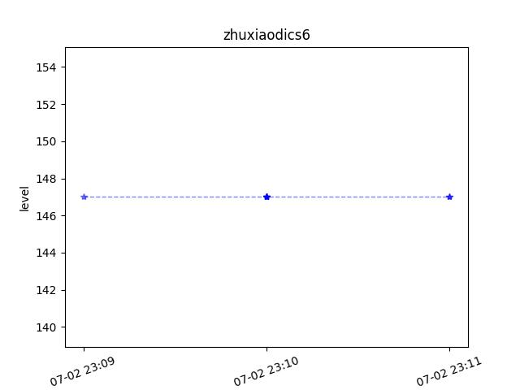

# My Hypixel Data Recorder alpha 1.0

## 简介
## Summary

这是一个简单的个人小项目，用于记录我在Hypixel的数据变化

This is a simple little personal project to record my data changes at Hypixel

项目核心使用了Hypixel api与Python来对我的数据进行获取并记录生成折线图

The core of the project uses the Hypixel api and Python to fetch and record my data to generate line graphs.

项目部署在我家中的个人服务器上，仅在局域网中使用，且调用频率非常的低，仅为五分钟一次

The project is deployed on my personal server at home, used only on the LAN, and called very infrequently, only once every five minutes.

## 代码与使用
## Code and how to use

Package             |Version
--------------------|---
aiohttp             |3.9.5
aiosignal           |1.3.1
async-timeout       |4.0.3
attrs               |23.2.0
blinker             |1.8.2
click               |8.1.7
colorama            |0.4.6
contourpy           |1.1.1
cycler              |0.12.1
Flask               |3.0.3
fonttools           |4.53.0
frozenlist          |1.4.1
hypixel.py          |0.4.2
idna                |3.7
importlib_metadata  |8.0.0
importlib_resources |6.4.0
itsdangerous        |2.2.0
Jinja2              |3.1.4
kiwisolver          |1.4.5
MarkupSafe          |2.1.5
matplotlib          |3.7.5
multidict           |6.0.5
numpy               |1.24.4
packaging           |24.1
pillow              |10.4.0
pip                 |24.0
pyparsing           |3.1.2
python-dateutil     |2.9.0.post0
setuptools          |69.5.1
six                 |1.16.0
Werkzeug            |3.0.3
wheel               |0.43.0
yarl                |1.9.4
zipp                |3.19.2

### 代码利用flask框架，提供以下接口

### 1./start

api：ip:port/start?username={username}
用于开启对指定用户数据的检测

### 2./info

api：ip:port/info
用于查询当前检测的用户名

### 3./stop

api：ip:port/stop?username={username}
用于关闭对指定用户数据的检测

### 4./stop

api：ip:port/pic?username={username}
用于生成对指定用户数据的折线图

### The code utilizes the flask framework to provide the following interfaces

### 1./start

api: ip:port/start?username={username}
Used to enable detection of the specified user's data

### 2./info

api:ip:port/info
Used to query the current user name for detection

### 3./stop

api: ip:port/stop?username={username}
Used to disable the detection of the specified user's data

### 4./stop

api: ip:port/pic?username={username}
Used to generate a line graph of the specified user's data.

## 效果与未来计划
## Effectiveness and Future Plans

目前能够实现对起床战争等级的记录，生成统计图，更加直观的展示变化。如下图
计划在后续的代码中添加对其他数据的支持例如击杀数据及获胜数据等

At present, it is able to realize the record of getting up war level and generate statistical graphs to show the changes more intuitively. The following chart
We plan to add support for other data such as kill data and win data in the subsequent code.

